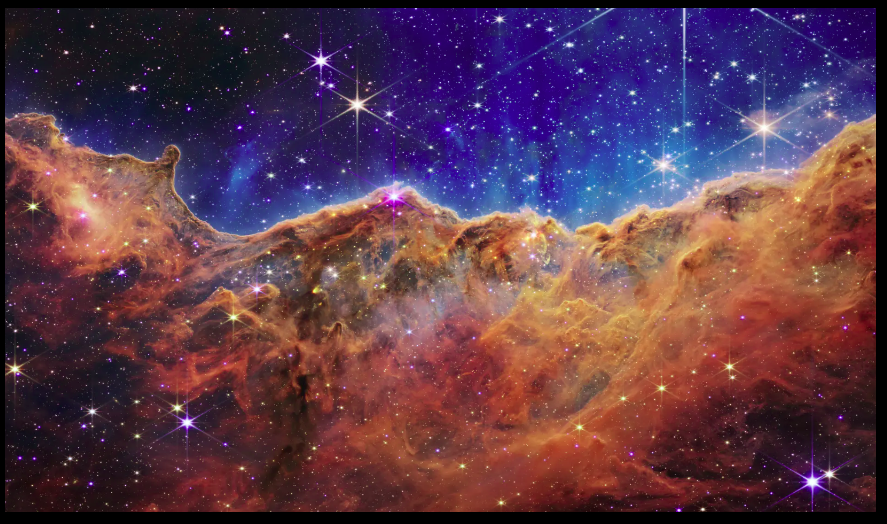
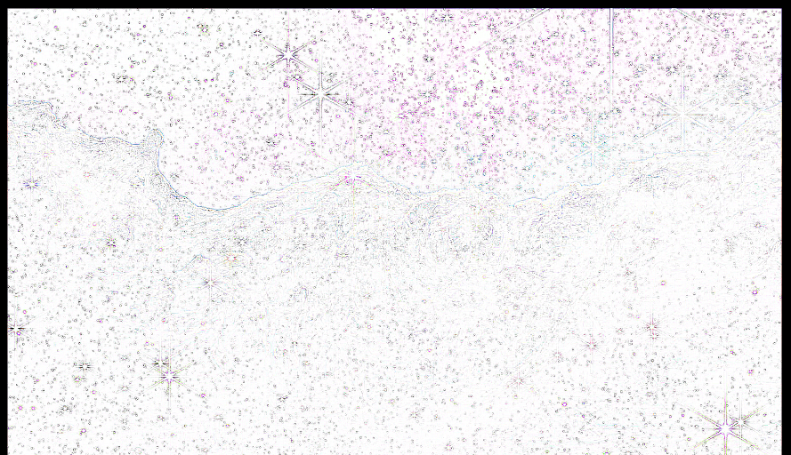

# ImageEditor  
A command line python program to edit images.  

The available options for editing are: **contour**, **blur** and **saturation**.  
You can add a number after saturation to choose the intensity.  
All the images you want to edit need to be put in the **'Photo_In'** folder, the results will be put in the **'Photo_Out'** folder.

## Examples
An unedited example image:  
  

Using the command 'blur' to blur the image:
```console
python3 imageEditor.py blur
```
  

Using the command 'contour':
```console
python3 imageEditor.py contour
```
  

Using the command 'saturation' to highten the saturation (the standard factor is 2):
```console
python3 imageEditor.py saturation
```
  

Using the command 'saturation' with a number to highten/lessen the saturation a certain amount (in this example the factor is 6):
```console
python3 imageEditor.py saturation 6
```
  
  
